<br />

***

# 业务背景

当企业开通 VKE 容器服务并创建集群时，需要同时创建如 VPC、子网、NAT网关等一系列依赖资源，同时创建容器集群需要选择诸多参数并安装基础组件，手动创建流程冗长复杂。人工操作易引入配置错误，导致环境不一致，难以实现标准化交付。为了避免人工干预扩缩容的延迟和错误，保持应用性能和稳定性，并快速应对流量波峰波谷，我们需要一种自动化的解决方案。

<br />

## 方案概述

通过 Terraform 的方式，实现一键式、自动化的 VKE 集群部署。该方案确保架构高可用（多可用区部署）、具备安全统一的公网出向能力（NAT 网关 + SNAT 规则），并集成统一的公网入口（ALB 负载均衡）、集中化日志（SLS / log-collector）与基础监控能力（Prometheus）。

## 架构图

```mermaid
graph TB
    subgraph Internet["☁️ 互联网"]
        InternetGW["互联网出口"]
    end
 
    subgraph VPC["🛡️ VPC — volcenginecc_vpc_vpc"]
        direction TB
 
        subgraph NodeZone["📦 Node 交换机层"]
            NodeVSwitch1["volcenginecc_vpc_subnet.node_subnet[0]<br/>Zone N"]
            NodeVSwitch2["volcenginecc_vpc_subnet.node_subnet[1]<br/>Zone N+1"]
        end
 
        subgraph PodZone["📦 Pod 交换机层"]
            PodVSwitch1["volcenginecc_vpc_subnet.pod_subnet[0]<br/>Zone N"]
            PodVSwitch2["volcenginecc_vpc_subnet.pod_subnet[1]<br/>Zone N+1"]
        end
 
        subgraph VKECluster["☸️ VKE 托管集群 — volcenginecc_vke_cluster"]
            direction TB
            ControlPlane["📋 控制平面<br/>(托管)"]
 
            subgraph Addons["🔧 集群组件"]
                Prometheus["prometheus-agent"]
                LogCollector["log-collector"]
                NPD["node-problem-detector"]
                ALB["alb-ingress-controller"]
                CSI["csi"]
            end
 
            subgraph NodePool["🖥️ 节点池 — volcenginecc_vke_node_pool"]
                Worker1["Worker Node 1"]
                Worker2["Worker Node 2"]
            end
        end
 
        subgraph NATLayer["🌐 NAT 网关层"]
            NATGW["volcenginecc_natgateway_ngw.nat_gateway"]
            NodeSNAT["volcenginecc_natgateway_snatentry.node_snat<br/>Node 交换机 → SNAT"]
            PodSNAT["volcenginecc_natgateway_snatentry.pod_snat<br/>Pod 交换机 → SNAT"]
        end
    end
 
    EIP["volcenginecc_vpc_eip.eip"]
 
    InternetGW <--> EIP
    EIP --- NATGW
 
    NATGW --> NodeSNAT
    NATGW --> PodSNAT
 
    NodeSNAT --> NodeVSwitch1
    NodeSNAT --> NodeVSwitch2
 
    PodSNAT --> PodVSwitch1
    PodSNAT --> PodVSwitch2
 
    NodeVSwitch1 --- Worker1
    NodeVSwitch2 --- Worker2
 
    PodVSwitch1 --- Worker1
    PodVSwitch2 --- Worker2
 
    ControlPlane --> Worker1
    ControlPlane --> Worker2
    ControlPlane --> Prometheus
    ControlPlane --> LogCollector
    ControlPlane --> NPD
    ControlPlane --> ALB
    ControlPlane --> CSI
 
    ALB_LoadBalancer["volcenginecc_alb_load_balancer.alb<br/>ALB 负载均衡"]
    ALB_LoadBalancer --> ControlPlane
 
    classDef vpc fill:#4A90D9,stroke:#2C5F8A,color:#fff
    classDef vswitch fill:#7EC8E3,stroke:#4A90D9,color:#000
    classDef nat fill:#F5A623,stroke:#D4880F,color:#000
    classDef eip fill:#BD10E0,stroke:#8B0AA5,color:#fff
    classDef k8s fill:#326CE5,stroke:#1A4FA0,color:#fff
    classDef node fill:#6DBE47,stroke:#4A8A2F,color:#fff
    classDef addon fill:#9B9B9B,stroke:#6B6B6B,color:#fff
    classDef internet fill:#D0021B,stroke:#9B0014,color:#fff
 
    class VPC vpc
    class NodeVSwitch1,NodeVSwitch2,PodVSwitch1,PodVSwitch2 vswitch
    class NATGW,NodeSNAT,PodSNAT nat
    class EIP eip
    class VKECluster,ControlPlane k8s
    class NodePool,Worker1,Worker2 node
    class Prometheus,LogCollector,NPD,ALB,CSI addon
    class Internet,InternetGW internet
```



## IaC 设计

### 资源与模块依赖

| **Terraform 资源** | **用途** |
| :--- | :--- |
| `volcenginecc_vpc_vpc` | 创建私有网络，提供资源逻辑隔离的环境。 |
| `volcenginecc_vpc_subnet` | 创建子网，分别用于 VKE 集群的 Node 节点和 Pod 实例，实现跨可用区高可用。 |
| `volcenginecc_vpc_eip` | 创建弹性公网 IP，用于 NAT 网关提供公网出口。 |
| `volcenginecc_natgateway_ngw` | 创建 NAT 网关，结合 SNAT 规则解决节点和 Pod 访问公网的需求。 |
| `volcenginecc_natgateway_snatentry` | 配置 SNAT 规则，绑定子网和 EIP。 |
| `volcenginecc_alb_load_balancer` | 创建应用型负载均衡实例，作为集群统一的公网入口。 |
| `volcenginecc_vke_cluster` | 创建托管版 VKE 容器集群。 |
| `volcenginecc_vke_node_pool` | 创建并配置节点池，开启自动弹性伸缩（Auto Scaling）应对流量变化。 |
| `volcenginecc_vke_addon` | 安装并管理集群插件，如 `prometheus-agent`、`log-collector`、`alb-ingress-controller` 等。 |

### Terraform 工程结构

采用模块化设计，主目录负责高层资源编排，底层网络与集群拆分为独立的模块：

```text
vke-automation/
├── main.tf              # 根模块主入口：调用网络和 VKE 子模块
├── variables.tf         # 全局输入变量
├── outputs.tf           # 核心资源输出（如 vpc_id, cluster_id）
├── providers.tf         # 火山引擎 Provider 配置
├── versions.tf          # Terraform 和 Provider 版本约束
├── terraform.tfvars     # 环境变量示例赋值
├── locals.tf            # 局部变量（如全局标签 tags）
├── modules/             # 可复用子模块目录
│   ├── network/         # 网络模块：包含 VPC、Subnet、NAT、EIP、SNAT、ALB
│   └── vke/             # VKE 集群模块：包含 Cluster、NodePool、Addons
└── README.md            # 项目说明文档
```

## 使用说明

### 1. 环境准备

请确保您已配置好火山引擎的认证凭据（推荐使用环境变量）：

```bash
export VOLCENGINE_ACCESS_KEY="your_ak"
export VOLCENGINE_SECRET_KEY="your_sk"
export VOLCENGINE_REGION="cn-beijing"
```

### 2. 初始化与部署

进入 `vke-automation` 目录，执行以下命令：

```bash
# 初始化 Terraform
terraform init

# 预览变更计划
terraform plan

# 应用并创建资源
terraform apply
```

### 3. 销毁资源

若需要清理所有自动化创建的基础设施，执行：

```bash
terraform destroy
```

> **注意：** 销毁操作会删除集群、网络及所有关联组件，请谨慎操作！
